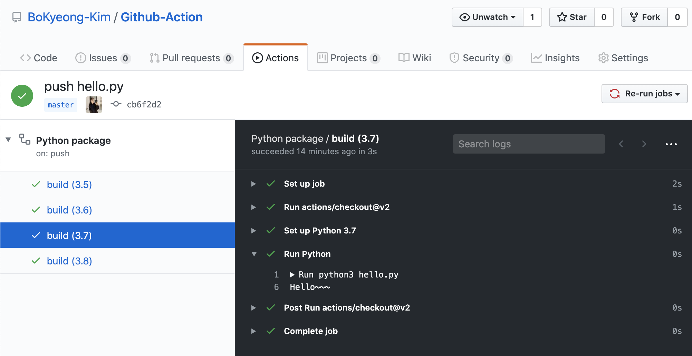

# Github-Action

[kyle-school과제](https://zzsza.github.io/kyle-school/week8/#/) 겸 초미니 프로젝트

---------

### Github Action - IT뉴스 자동 알림서비스 
- 예전에 자주 들어갔었던 [itworld](http://www.itworld.co.kr/insight)의 인사이트를 issue에 업로드
- 알아두면 좋은 깨알팁들 많음! 
- 카일스쿨 과제이기도 하고, Github Action에 대한 궁금증을 풀 수 있는 아주 좋은 기회 :) 

-----------------------

#### hello.py 튜토리얼!
- Action > Python-package > push hello.py 확인 결과
- python-package.yml에 `python-version`마다 확인할 수 있다.
- 테스트 성공

